```mermaid
flowchart TD
  abstract_crystals["Abstract Crystals"]
  affine_objects_in_monoidal_categories["Affine Objects in Monoidal Categories"]
  b_infinity_crystal["The Crystal B(infinity)"]
  category_localization["Localization of Categories"]
  category_theory["Category Theory"]
  cellular_crystals["Cellular Crystals"]
  coordinate_formulas_for_quantum_twist_on_localized_crystals["Coordinate Formulas for Quantum Twist on Localized Crystals"]
  crystal_bases["Crystal Bases"]
  demazure_crystals["Demazure Crystals"]
  demazure_subcategories_of_quiver_hecke_modules["Demazure Subcategories of Quiver-Hecke Modules"]
  graded_monoidal_categories["Graded Monoidal Categories"]
  highest_weight_crystals["Highest Weight Crystals"]
  left_and_right_g_vectors["Left and Right g-Vectors"]
  localized_crystals["Localized Crystals"]
  localized_pbw_parametrizations["Localized PBW Parametrizations"]
  localized_root_operators["Localized Root Operators"]
  localized_string_parametrizations["Localized String Parametrizations"]
  normal_sequences["Normal Sequences"]
  pbw_parametrizations_of_quantum_unipotent_coordinate_rings["PBW Parametrizations of Quantum Unipotent Coordinate Rings"]
  pro_categories["Pro-Categories"]
  quantum_coordinate_rings["Quantum Coordinate Rings"]
  quantum_groups["Quantum Groups"]
  quantum_twist_automorphisms["Quantum Twist Automorphisms"]
  quantum_unipotent_coordinate_rings["Quantum Unipotent Coordinate Rings"]
  quasi_rigid_monoidal_categories["Quasi-Rigid Monoidal Categories"]
  quiver_hecke_category_localization["Quiver-Hecke Category Localization"]
  quiver_hecke_subcategories["Quiver-Hecke Subcategories"]
  r_matrix_renormalization["R-Matrix Renormalization"]
  reverse_equivalence_of_localized_categories["Reverse Equivalence of Localized Categories"]
  root_objects_in_localized_categories["Root Objects in Localized Categories"]
  root_systems_and_weight_lattices["Root Systems and Weight Lattices"]
  tensor_products_of_crystals["Tensor Products of Crystals"]
  universal_enveloping_algebras["Universal Enveloping Algebras"]
  abstract_crystals -->|prereq| b_infinity_crystal
  abstract_crystals -->|prereq| cellular_crystals
  abstract_crystals -->|prereq| highest_weight_crystals
  abstract_crystals -->|prereq| localized_string_parametrizations
  abstract_crystals -->|prereq/related| tensor_products_of_crystals
  affine_objects_in_monoidal_categories -->|prereq| normal_sequences
  affine_objects_in_monoidal_categories -->|prereq| quasi_rigid_monoidal_categories
  affine_objects_in_monoidal_categories -->|related| r_matrix_renormalization
  affine_objects_in_monoidal_categories -->|prereq/related| root_objects_in_localized_categories
  b_infinity_crystal -->|prereq| cellular_crystals
  b_infinity_crystal -->|parent/prereq| demazure_crystals
  b_infinity_crystal -->|related| highest_weight_crystals
  b_infinity_crystal -->|prereq| localized_pbw_parametrizations
  category_localization -->|parent/prereq| quiver_hecke_category_localization
  category_theory -->|parent/prereq| category_localization
  category_theory -->|parent/prereq| graded_monoidal_categories
  category_theory -->|parent/prereq| pro_categories
  cellular_crystals -->|prereq/related| localized_crystals
  coordinate_formulas_for_quantum_twist_on_localized_crystals -->|related| quantum_coordinate_rings
  crystal_bases -->|parent/prereq| abstract_crystals
  crystal_bases -->|parent| b_infinity_crystal
  crystal_bases -->|parent| cellular_crystals
  crystal_bases -->|parent| demazure_crystals
  crystal_bases -->|parent| highest_weight_crystals
  crystal_bases -->|prereq/context_for/related| localized_crystals
  crystal_bases -->|parent| tensor_products_of_crystals
  demazure_crystals -->|prereq/related| cellular_crystals
  demazure_crystals -->|prereq/related| demazure_subcategories_of_quiver_hecke_modules
  demazure_subcategories_of_quiver_hecke_modules -->|related| cellular_crystals
  demazure_subcategories_of_quiver_hecke_modules -->|related| demazure_crystals
  demazure_subcategories_of_quiver_hecke_modules -->|prereq/related| localized_crystals
  graded_monoidal_categories -->|parent/prereq| affine_objects_in_monoidal_categories
  graded_monoidal_categories -->|related| localized_crystals
  graded_monoidal_categories -->|parent| quasi_rigid_monoidal_categories
  graded_monoidal_categories -->|parent/prereq| r_matrix_renormalization
  highest_weight_crystals -->|related| b_infinity_crystal
  highest_weight_crystals -->|prereq| demazure_crystals
  left_and_right_g_vectors -->|prereq| coordinate_formulas_for_quantum_twist_on_localized_crystals
  left_and_right_g_vectors -->|related| quantum_twist_automorphisms
  localized_crystals -->|prereq| coordinate_formulas_for_quantum_twist_on_localized_crystals
  localized_crystals -->|related| crystal_bases
  localized_crystals -->|parent/prereq| left_and_right_g_vectors
  localized_crystals -->|parent/prereq| localized_pbw_parametrizations
  localized_crystals -->|parent| localized_root_operators
  localized_crystals -->|parent/prereq| localized_string_parametrizations
  localized_crystals -->|parent/prereq| quantum_twist_automorphisms
  localized_pbw_parametrizations -->|prereq| coordinate_formulas_for_quantum_twist_on_localized_crystals
  localized_pbw_parametrizations -->|prereq/related| left_and_right_g_vectors
  localized_pbw_parametrizations -->|related| localized_string_parametrizations
  localized_root_operators -->|related| cellular_crystals
  localized_string_parametrizations -->|prereq| coordinate_formulas_for_quantum_twist_on_localized_crystals
  localized_string_parametrizations -->|prereq/related| left_and_right_g_vectors
  localized_string_parametrizations -->|related| localized_pbw_parametrizations
  normal_sequences -->|context_for/related| localized_root_operators
  normal_sequences -->|context_for/related| root_objects_in_localized_categories
  pbw_parametrizations_of_quantum_unipotent_coordinate_rings -->|prereq/related| localized_pbw_parametrizations
  pro_categories -->|parent/prereq| affine_objects_in_monoidal_categories
  pro_categories -->|related| category_localization
  quantum_coordinate_rings -->|prereq| quantum_twist_automorphisms
  quantum_coordinate_rings -->|parent/prereq| quantum_unipotent_coordinate_rings
  quantum_coordinate_rings -->|related| quiver_hecke_category_localization
  quantum_coordinate_rings -->|prereq| quiver_hecke_subcategories
  quantum_groups -->|prereq| b_infinity_crystal
  quantum_groups -->|parent/prereq| crystal_bases
  quantum_groups -->|prereq| highest_weight_crystals
  quantum_groups -->|prereq| pbw_parametrizations_of_quantum_unipotent_coordinate_rings
  quantum_groups -->|parent/prereq| quantum_coordinate_rings
  quantum_twist_automorphisms -->|parent/prereq| coordinate_formulas_for_quantum_twist_on_localized_crystals
  quantum_twist_automorphisms -->|related| quantum_unipotent_coordinate_rings
  quantum_twist_automorphisms -->|related| reverse_equivalence_of_localized_categories
  quantum_unipotent_coordinate_rings -->|related| localized_crystals
  quantum_unipotent_coordinate_rings -->|prereq| localized_pbw_parametrizations
  quantum_unipotent_coordinate_rings -->|parent/prereq| pbw_parametrizations_of_quantum_unipotent_coordinate_rings
  quasi_rigid_monoidal_categories -->|related| localized_crystals
  quasi_rigid_monoidal_categories -->|parent| root_objects_in_localized_categories
  quiver_hecke_category_localization -->|parent/prereq| localized_crystals
  quiver_hecke_category_localization -->|prereq| localized_root_operators
  quiver_hecke_category_localization -->|related| quantum_coordinate_rings
  quiver_hecke_category_localization -->|parent/prereq| reverse_equivalence_of_localized_categories
  quiver_hecke_category_localization -->|parent/prereq| root_objects_in_localized_categories
  quiver_hecke_subcategories -->|parent/prereq| demazure_subcategories_of_quiver_hecke_modules
  quiver_hecke_subcategories -->|parent/prereq| quiver_hecke_category_localization
  r_matrix_renormalization -->|related| affine_objects_in_monoidal_categories
  r_matrix_renormalization -->|prereq| localized_root_operators
  r_matrix_renormalization -->|parent/prereq| normal_sequences
  r_matrix_renormalization -->|prereq| quasi_rigid_monoidal_categories
  r_matrix_renormalization -->|prereq/related| root_objects_in_localized_categories
  reverse_equivalence_of_localized_categories -->|related| localized_crystals
  root_objects_in_localized_categories -->|related| localized_crystals
  root_objects_in_localized_categories -->|parent/prereq| localized_root_operators
  root_systems_and_weight_lattices -->|prereq| abstract_crystals
  root_systems_and_weight_lattices -->|prereq/related| crystal_bases
  root_systems_and_weight_lattices -->|prereq| quantum_coordinate_rings
  root_systems_and_weight_lattices -->|prereq/related| quantum_groups
  root_systems_and_weight_lattices -->|related| universal_enveloping_algebras
  tensor_products_of_crystals -->|prereq| b_infinity_crystal
  tensor_products_of_crystals -->|prereq/related| cellular_crystals
  tensor_products_of_crystals -->|prereq/related| highest_weight_crystals
  universal_enveloping_algebras -->|prereq| quantum_groups
  universal_enveloping_algebras -->|related| root_systems_and_weight_lattices
```

## Topics

- [[topics/02-crystal-bases/abstract-crystals|Abstract Crystals]]
- [[topics/03-category-theory/affine-objects-in-monoidal-categories|Affine Objects in Monoidal Categories]]
- [[topics/02-crystal-bases/b-infinity-crystal|The Crystal B(infinity)]]
- [[topics/08-localization-of-categories/category-localization|Localization of Categories]]
- [[topics/03-category-theory/category-theory|Category Theory]]
- [[topics/02-crystal-bases/cellular-crystals|Cellular Crystals]]
- [[topics/08-localization-of-categories/coordinate-formulas-for-quantum-twist-on-localized-crystals|Coordinate Formulas for Quantum Twist on Localized Crystals]]
- [[topics/02-crystal-bases/crystal-bases|Crystal Bases]]
- [[topics/02-crystal-bases/demazure-crystals|Demazure Crystals]]
- [[topics/06-quiver-hecke-klr-algebras/demazure-subcategories-of-quiver-hecke-modules|Demazure Subcategories of Quiver-Hecke Modules]]
- [[topics/03-category-theory/graded-monoidal-categories|Graded Monoidal Categories]]
- [[topics/02-crystal-bases/highest-weight-crystals|Highest Weight Crystals]]
- [[topics/08-localization-of-categories/left-and-right-g-vectors|Left and Right g-Vectors]]
- [[topics/08-localization-of-categories/localized-crystals|Localized Crystals]]
- [[topics/08-localization-of-categories/localized-pbw-parametrizations|Localized PBW Parametrizations]]
- [[topics/08-localization-of-categories/localized-root-operators|Localized Root Operators]]
- [[topics/08-localization-of-categories/localized-string-parametrizations|Localized String Parametrizations]]
- [[topics/06-quiver-hecke-klr-algebras/normal-sequences|Normal Sequences]]
- [[topics/01-quantum-groups/pbw-parametrizations-of-quantum-unipotent-coordinate-rings|PBW Parametrizations of Quantum Unipotent Coordinate Rings]]
- [[topics/03-category-theory/pro-categories|Pro-Categories]]
- [[topics/01-quantum-groups/quantum-coordinate-rings|Quantum Coordinate Rings]]
- [[topics/01-quantum-groups/quantum-groups|Quantum Groups]]
- [[topics/08-localization-of-categories/quantum-twist-automorphisms|Quantum Twist Automorphisms]]
- [[topics/01-quantum-groups/quantum-unipotent-coordinate-rings|Quantum Unipotent Coordinate Rings]]
- [[topics/03-category-theory/quasi-rigid-monoidal-categories|Quasi-Rigid Monoidal Categories]]
- [[topics/08-localization-of-categories/quiver-hecke-category-localization|Quiver-Hecke Category Localization]]
- [[topics/06-quiver-hecke-klr-algebras/quiver-hecke-subcategories|Quiver-Hecke Subcategories]]
- [[topics/06-quiver-hecke-klr-algebras/r-matrix-renormalization|R-Matrix Renormalization]]
- [[topics/08-localization-of-categories/reverse-equivalence-of-localized-categories|Reverse Equivalence of Localized Categories]]
- [[topics/08-localization-of-categories/root-objects-in-localized-categories|Root Objects in Localized Categories]]
- [[topics/01-quantum-groups/root-systems-and-weight-lattices|Root Systems and Weight Lattices]]
- [[topics/02-crystal-bases/tensor-products-of-crystals|Tensor Products of Crystals]]
- [[topics/01-quantum-groups/universal-enveloping-algebras|Universal Enveloping Algebras]]
