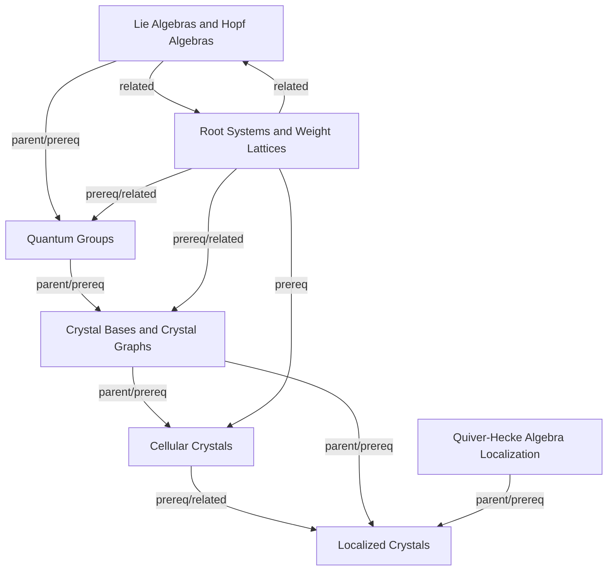

# Crystal Bases Map

## Topics

- [[topics/cellular-crystals|Cellular Crystals]]
- [[topics/crystal-bases|Crystal Bases and Crystal Graphs]]
- [[topics/lie-algebras-and-hopf-algebras|Lie Algebras and Hopf Algebras]]
- [[topics/localized-crystals|Localized Crystals]]
- [[topics/quantum-groups|Quantum Groups]]
- [[topics/quiver-hecke-algebra-localization|Quiver-Hecke Algebra Localization]]
- [[topics/root-systems-and-weight-lattices|Root Systems and Weight Lattices]]
