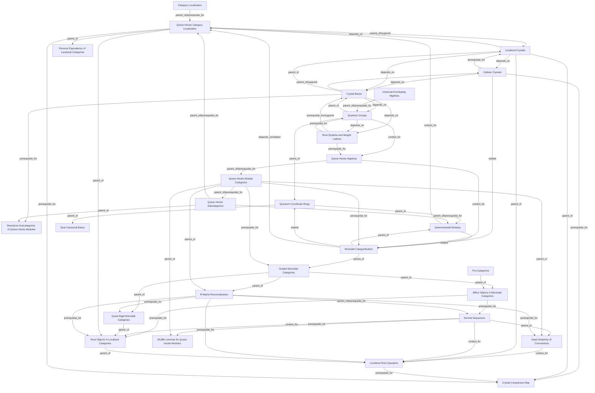

## Topics

- [[topics/affine-objects-in-monoidal-categories|Affine Objects in Monoidal Categories]]
- [[topics/category-localization|Category Localization]]
- [[topics/cellular-crystals|Cellular Crystals]]
- [[topics/crystal-bases|Crystal Bases]]
- [[topics/crystal-comparison-map|Crystal Comparison Map]]
- [[topics/demazure-subcategories-of-quiver-hecke-modules|Demazure Subcategories of Quiver-Hecke Modules]]
- [[topics/determinantial-modules|Determinantial Modules]]
- [[topics/dual-canonical-bases|Dual Canonical Bases]]
- [[topics/graded-monoidal-categories|Graded Monoidal Categories]]
- [[topics/head-simplicity-of-convolutions|Head Simplicity of Convolutions]]
- [[topics/localized-crystals|Localized Crystals]]
- [[topics/localized-root-operators|Localized Root Operators]]
- [[topics/monoidal-categorification|Monoidal Categorification]]
- [[topics/normal-sequences|Normal Sequences]]
- [[topics/pro-categories|Pro-Categories]]
- [[topics/quantum-coordinate-rings|Quantum Coordinate Rings]]
- [[topics/quantum-groups|Quantum Groups]]
- [[topics/quasi-rigid-monoidal-categories|Quasi-Rigid Monoidal Categories]]
- [[topics/quiver-hecke-algebras|Quiver-Hecke Algebras]]
- [[topics/quiver-hecke-category-localization|Quiver-Hecke Category Localization]]
- [[topics/quiver-hecke-module-categories|Quiver-Hecke Module Categories]]
- [[topics/quiver-hecke-subcategories|Quiver-Hecke Subcategories]]
- [[topics/r-matrix-renormalization|R-Matrix Renormalization]]
- [[topics/reverse-equivalence-of-localized-categories|Reverse Equivalence of Localized Categories]]
- [[topics/root-objects-in-localized-categories|Root Objects in Localized Categories]]
- [[topics/root-systems-and-weight-lattices|Root Systems and Weight Lattices]]
- [[topics/shuffle-lemmas-for-quiver-hecke-modules|Shuffle Lemmas for Quiver-Hecke Modules]]
- [[topics/universal-enveloping-algebras|Universal Enveloping Algebras]]
