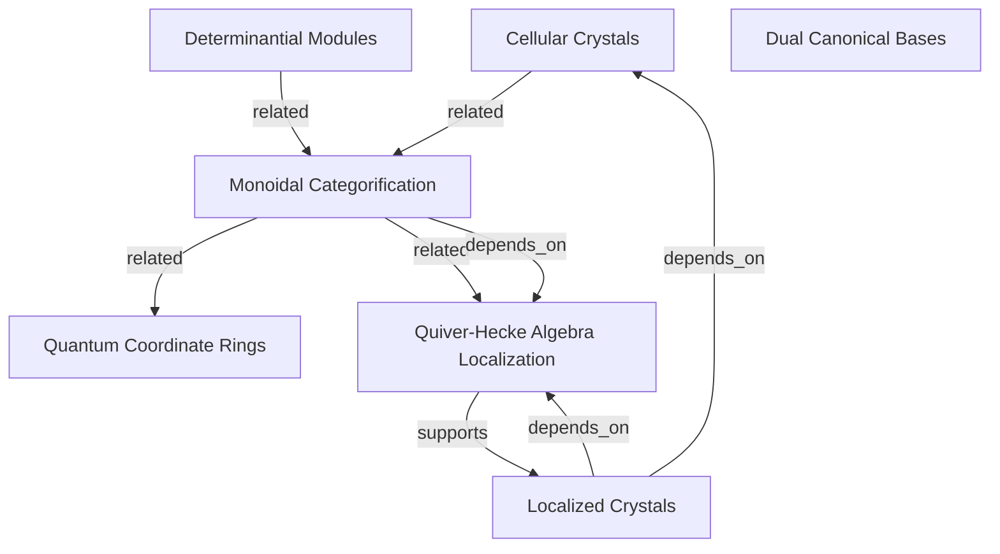

# Global Topic Graph

```mermaid
flowchart TD
  cellular_crystals["Cellular Crystals"]
  determinantial_modules["Determinantial Modules"]
  dual_canonical_bases["Dual Canonical Bases"]
  localized_crystals["Localized Crystals"]
  monoidal_categorification["Monoidal Categorification"]
  quantum_coordinate_rings["Quantum Coordinate Rings"]
  quiver_hecke_algebra_localization["Quiver-Hecke Algebra Localization"]
  monoidal_categorification -->|related| quantum_coordinate_rings
  monoidal_categorification -->|related| quiver_hecke_algebra_localization
  determinantial_modules -->|related| monoidal_categorification
  monoidal_categorification -->|depends_on| quiver_hecke_algebra_localization
  localized_crystals -->|depends_on| quiver_hecke_algebra_localization
  localized_crystals -->|depends_on| cellular_crystals
  cellular_crystals -->|related| monoidal_categorification
  quiver_hecke_algebra_localization -->|supports| localized_crystals
```
