```mermaid
flowchart TD
  affine_objects_in_monoidal_categories["Affine Objects in Monoidal Categories"]
  category_localization["Localization of Categories"]
  cluster_algebras["Cluster Algebras"]
  coordinate_formulas_for_quantum_twist_on_localized_crystals["Coordinate Formulas for Quantum Twist on Localized Crystals"]
  demazure_crystals["Demazure Crystals"]
  demazure_subcategories_of_quiver_hecke_modules["Demazure Subcategories of Quiver-Hecke Modules"]
  determinantial_modules["Determinantial Modules"]
  graded_monoidal_categories["Graded Monoidal Categories"]
  grothendieck_rings_of_monoidal_categories["Grothendieck Rings of Monoidal Categories"]
  head_simplicity_of_convolutions["Head Simplicity of Convolutions"]
  left_and_right_g_vectors["Left and Right g-Vectors"]
  localized_crystals["Localized Crystals"]
  localized_pbw_parametrizations["Localized PBW Parametrizations"]
  localized_root_operators["Localized Root Operators"]
  localized_string_parametrizations["Localized String Parametrizations"]
  monoidal_categorification["Monoidal Categorification"]
  normal_sequences["Normal Sequences"]
  quantum_cluster_algebras["Quantum Cluster Algebras"]
  quantum_coordinate_rings["Quantum Coordinate Rings"]
  quantum_minors_and_frozen_variables["Quantum Minors and Frozen Variables"]
  quantum_twist_automorphisms["Quantum Twist Automorphisms"]
  quantum_unipotent_coordinate_rings["Quantum Unipotent Coordinate Rings"]
  quasi_rigid_monoidal_categories["Quasi-Rigid Monoidal Categories"]
  quiver_hecke_algebras["Quiver-Hecke Algebras"]
  quiver_hecke_category_localization["Quiver-Hecke Category Localization"]
  quiver_hecke_module_categories["Quiver-Hecke Module Categories"]
  quiver_hecke_subcategories["Quiver-Hecke Subcategories"]
  r_matrix_renormalization["R-Matrix Renormalization"]
  reverse_equivalence_of_localized_categories["Reverse Equivalence of Localized Categories"]
  root_objects_in_localized_categories["Root Objects in Localized Categories"]
  shuffle_lemmas_for_quiver_hecke_modules["Shuffle Lemmas for Quiver-Hecke Modules"]
  affine_objects_in_monoidal_categories -->|prereq| normal_sequences
  affine_objects_in_monoidal_categories -->|prereq| quasi_rigid_monoidal_categories
  affine_objects_in_monoidal_categories -->|related| r_matrix_renormalization
  affine_objects_in_monoidal_categories -->|prereq/related| root_objects_in_localized_categories
  category_localization -->|related| monoidal_categorification
  category_localization -->|parent/prereq| quiver_hecke_category_localization
  cluster_algebras -->|prereq/related| monoidal_categorification
  cluster_algebras -->|parent/prereq| quantum_cluster_algebras
  coordinate_formulas_for_quantum_twist_on_localized_crystals -->|related| quantum_coordinate_rings
  demazure_crystals -->|prereq/related| demazure_subcategories_of_quiver_hecke_modules
  demazure_subcategories_of_quiver_hecke_modules -->|related| demazure_crystals
  demazure_subcategories_of_quiver_hecke_modules -->|prereq/related| localized_crystals
  determinantial_modules -->|prereq| left_and_right_g_vectors
  determinantial_modules -->|prereq/context_for/related| quiver_hecke_category_localization
  graded_monoidal_categories -->|parent/prereq| affine_objects_in_monoidal_categories
  graded_monoidal_categories -->|prereq| grothendieck_rings_of_monoidal_categories
  graded_monoidal_categories -->|related| localized_crystals
  graded_monoidal_categories -->|context_for/related| monoidal_categorification
  graded_monoidal_categories -->|parent| quasi_rigid_monoidal_categories
  graded_monoidal_categories -->|context_for/related| quiver_hecke_module_categories
  graded_monoidal_categories -->|parent/prereq| r_matrix_renormalization
  grothendieck_rings_of_monoidal_categories -->|related| quantum_cluster_algebras
  grothendieck_rings_of_monoidal_categories -->|related| quantum_coordinate_rings
  head_simplicity_of_convolutions -->|context_for/related| localized_root_operators
  head_simplicity_of_convolutions -->|related| root_objects_in_localized_categories
  head_simplicity_of_convolutions -->|prereq| shuffle_lemmas_for_quiver_hecke_modules
  left_and_right_g_vectors -->|prereq| coordinate_formulas_for_quantum_twist_on_localized_crystals
  left_and_right_g_vectors -->|related| quantum_twist_automorphisms
  localized_crystals -->|prereq| coordinate_formulas_for_quantum_twist_on_localized_crystals
  localized_crystals -->|parent/prereq| left_and_right_g_vectors
  localized_crystals -->|parent/prereq| localized_pbw_parametrizations
  localized_crystals -->|parent| localized_root_operators
  localized_crystals -->|parent/prereq| localized_string_parametrizations
  localized_crystals -->|related| monoidal_categorification
  localized_crystals -->|parent/prereq| quantum_twist_automorphisms
  localized_pbw_parametrizations -->|prereq| coordinate_formulas_for_quantum_twist_on_localized_crystals
  localized_pbw_parametrizations -->|prereq/related| left_and_right_g_vectors
  localized_pbw_parametrizations -->|related| localized_string_parametrizations
  localized_string_parametrizations -->|prereq| coordinate_formulas_for_quantum_twist_on_localized_crystals
  localized_string_parametrizations -->|prereq/related| left_and_right_g_vectors
  localized_string_parametrizations -->|related| localized_pbw_parametrizations
  monoidal_categorification -->|related| cluster_algebras
  monoidal_categorification -->|parent/prereq| determinantial_modules
  monoidal_categorification -->|related| graded_monoidal_categories
  monoidal_categorification -->|parent| grothendieck_rings_of_monoidal_categories
  monoidal_categorification -->|related| localized_crystals
  monoidal_categorification -->|related| quantum_cluster_algebras
  monoidal_categorification -->|prereq/related| quiver_hecke_category_localization
  monoidal_categorification -->|related| quiver_hecke_subcategories
  normal_sequences -->|parent/prereq| head_simplicity_of_convolutions
  normal_sequences -->|context_for/related| localized_root_operators
  normal_sequences -->|context_for/related| root_objects_in_localized_categories
  normal_sequences -->|prereq| shuffle_lemmas_for_quiver_hecke_modules
  quantum_cluster_algebras -->|prereq/related| left_and_right_g_vectors
  quantum_cluster_algebras -->|prereq/related| monoidal_categorification
  quantum_cluster_algebras -->|context_for/related| quantum_coordinate_rings
  quantum_cluster_algebras -->|prereq/context_for| quantum_minors_and_frozen_variables
  quantum_coordinate_rings -->|parent/prereq| determinantial_modules
  quantum_coordinate_rings -->|prereq/related| monoidal_categorification
  quantum_coordinate_rings -->|related| quantum_cluster_algebras
  quantum_coordinate_rings -->|prereq| quantum_twist_automorphisms
  quantum_coordinate_rings -->|parent/prereq| quantum_unipotent_coordinate_rings
  quantum_coordinate_rings -->|related| quiver_hecke_category_localization
  quantum_coordinate_rings -->|prereq| quiver_hecke_subcategories
  quantum_minors_and_frozen_variables -->|related| determinantial_modules
  quantum_minors_and_frozen_variables -->|related| localized_crystals
  quantum_minors_and_frozen_variables -->|prereq| localized_pbw_parametrizations
  quantum_minors_and_frozen_variables -->|related| quantum_cluster_algebras
  quantum_twist_automorphisms -->|parent/prereq| coordinate_formulas_for_quantum_twist_on_localized_crystals
  quantum_twist_automorphisms -->|related| quantum_unipotent_coordinate_rings
  quantum_twist_automorphisms -->|related| reverse_equivalence_of_localized_categories
  quantum_unipotent_coordinate_rings -->|related| determinantial_modules
  quantum_unipotent_coordinate_rings -->|related| localized_crystals
  quantum_unipotent_coordinate_rings -->|prereq| localized_pbw_parametrizations
  quantum_unipotent_coordinate_rings -->|parent/prereq| quantum_minors_and_frozen_variables
  quasi_rigid_monoidal_categories -->|related| localized_crystals
  quasi_rigid_monoidal_categories -->|parent| root_objects_in_localized_categories
  quiver_hecke_algebras -->|context_for/related| monoidal_categorification
  quiver_hecke_algebras -->|parent/prereq| quiver_hecke_module_categories
  quiver_hecke_category_localization -->|parent/prereq| localized_crystals
  quiver_hecke_category_localization -->|prereq| localized_root_operators
  quiver_hecke_category_localization -->|related| quantum_coordinate_rings
  quiver_hecke_category_localization -->|parent/prereq| reverse_equivalence_of_localized_categories
  quiver_hecke_category_localization -->|parent/prereq| root_objects_in_localized_categories
  quiver_hecke_module_categories -->|prereq| grothendieck_rings_of_monoidal_categories
  quiver_hecke_module_categories -->|parent| head_simplicity_of_convolutions
  quiver_hecke_module_categories -->|prereq/related| monoidal_categorification
  quiver_hecke_module_categories -->|parent/prereq| quiver_hecke_subcategories
  quiver_hecke_module_categories -->|parent/prereq| r_matrix_renormalization
  quiver_hecke_module_categories -->|prereq| reverse_equivalence_of_localized_categories
  quiver_hecke_module_categories -->|parent/prereq| shuffle_lemmas_for_quiver_hecke_modules
  quiver_hecke_subcategories -->|parent/prereq| demazure_subcategories_of_quiver_hecke_modules
  quiver_hecke_subcategories -->|parent/prereq| determinantial_modules
  quiver_hecke_subcategories -->|related| monoidal_categorification
  quiver_hecke_subcategories -->|parent/prereq| quiver_hecke_category_localization
  r_matrix_renormalization -->|related| affine_objects_in_monoidal_categories
  r_matrix_renormalization -->|prereq| head_simplicity_of_convolutions
  r_matrix_renormalization -->|prereq| localized_root_operators
  r_matrix_renormalization -->|parent/prereq| normal_sequences
  r_matrix_renormalization -->|prereq| quasi_rigid_monoidal_categories
  r_matrix_renormalization -->|prereq/related| root_objects_in_localized_categories
  reverse_equivalence_of_localized_categories -->|related| localized_crystals
  root_objects_in_localized_categories -->|related| localized_crystals
  root_objects_in_localized_categories -->|parent/prereq| localized_root_operators
  shuffle_lemmas_for_quiver_hecke_modules -->|related| determinantial_modules
  shuffle_lemmas_for_quiver_hecke_modules -->|related| quiver_hecke_subcategories
```

## Topics

- [[topics/03-category-theory/affine-objects-in-monoidal-categories|Affine Objects in Monoidal Categories]]
- [[topics/08-localization-of-categories/category-localization|Localization of Categories]]
- [[topics/04-cluster-algebras/cluster-algebras|Cluster Algebras]]
- [[topics/08-localization-of-categories/coordinate-formulas-for-quantum-twist-on-localized-crystals|Coordinate Formulas for Quantum Twist on Localized Crystals]]
- [[topics/02-crystal-bases/demazure-crystals|Demazure Crystals]]
- [[topics/06-quiver-hecke-klr-algebras/demazure-subcategories-of-quiver-hecke-modules|Demazure Subcategories of Quiver-Hecke Modules]]
- [[topics/06-quiver-hecke-klr-algebras/determinantial-modules|Determinantial Modules]]
- [[topics/03-category-theory/graded-monoidal-categories|Graded Monoidal Categories]]
- [[topics/05-monoidal-categorification/grothendieck-rings-of-monoidal-categories|Grothendieck Rings of Monoidal Categories]]
- [[topics/06-quiver-hecke-klr-algebras/head-simplicity-of-convolutions|Head Simplicity of Convolutions]]
- [[topics/08-localization-of-categories/left-and-right-g-vectors|Left and Right g-Vectors]]
- [[topics/08-localization-of-categories/localized-crystals|Localized Crystals]]
- [[topics/08-localization-of-categories/localized-pbw-parametrizations|Localized PBW Parametrizations]]
- [[topics/08-localization-of-categories/localized-root-operators|Localized Root Operators]]
- [[topics/08-localization-of-categories/localized-string-parametrizations|Localized String Parametrizations]]
- [[topics/05-monoidal-categorification/monoidal-categorification|Monoidal Categorification]]
- [[topics/06-quiver-hecke-klr-algebras/normal-sequences|Normal Sequences]]
- [[topics/04-cluster-algebras/quantum-cluster-algebras|Quantum Cluster Algebras]]
- [[topics/01-quantum-groups/quantum-coordinate-rings|Quantum Coordinate Rings]]
- [[topics/01-quantum-groups/quantum-minors-and-frozen-variables|Quantum Minors and Frozen Variables]]
- [[topics/08-localization-of-categories/quantum-twist-automorphisms|Quantum Twist Automorphisms]]
- [[topics/01-quantum-groups/quantum-unipotent-coordinate-rings|Quantum Unipotent Coordinate Rings]]
- [[topics/03-category-theory/quasi-rigid-monoidal-categories|Quasi-Rigid Monoidal Categories]]
- [[topics/06-quiver-hecke-klr-algebras/quiver-hecke-algebras|Quiver-Hecke Algebras]]
- [[topics/08-localization-of-categories/quiver-hecke-category-localization|Quiver-Hecke Category Localization]]
- [[topics/06-quiver-hecke-klr-algebras/quiver-hecke-module-categories|Quiver-Hecke Module Categories]]
- [[topics/06-quiver-hecke-klr-algebras/quiver-hecke-subcategories|Quiver-Hecke Subcategories]]
- [[topics/06-quiver-hecke-klr-algebras/r-matrix-renormalization|R-Matrix Renormalization]]
- [[topics/08-localization-of-categories/reverse-equivalence-of-localized-categories|Reverse Equivalence of Localized Categories]]
- [[topics/08-localization-of-categories/root-objects-in-localized-categories|Root Objects in Localized Categories]]
- [[topics/06-quiver-hecke-klr-algebras/shuffle-lemmas-for-quiver-hecke-modules|Shuffle Lemmas for Quiver-Hecke Modules]]
