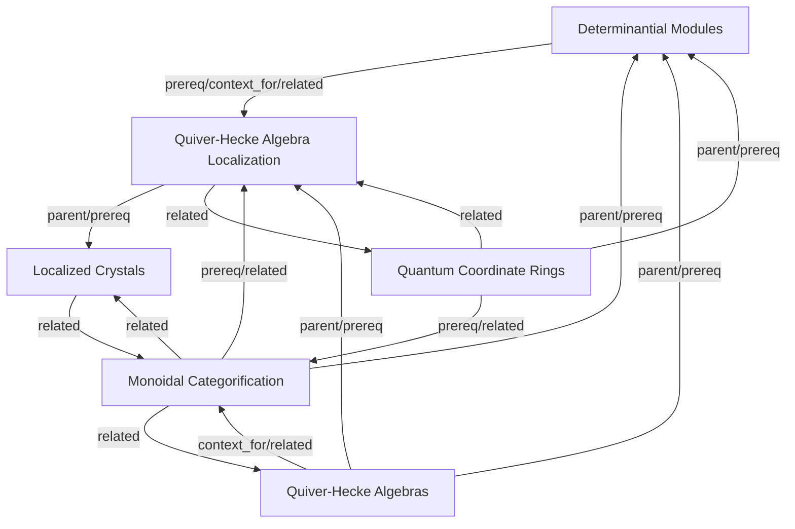

# Quiver-Hecke Algebras Map

## Topics

- [[topics/determinantial-modules|Determinantial Modules]]
- [[topics/localized-crystals|Localized Crystals]]
- [[topics/monoidal-categorification|Monoidal Categorification]]
- [[topics/quantum-coordinate-rings|Quantum Coordinate Rings]]
- [[topics/quiver-hecke-algebra-localization|Quiver-Hecke Algebra Localization]]
- [[topics/quiver-hecke-algebras|Quiver-Hecke Algebras]]
