```mermaid
flowchart TD
  affine_objects_in_monoidal_categories["Affine Objects in Monoidal Categories"]
  category_localization["Category Localization"]
  crystal_comparison_map["Crystal Comparison Map"]
  demazure_subcategories_of_quiver_hecke_modules["Demazure Subcategories of Quiver-Hecke Modules"]
  determinantial_modules["Determinantial Modules"]
  graded_monoidal_categories["Graded Monoidal Categories"]
  head_simplicity_of_convolutions["Head Simplicity of Convolutions"]
  localized_crystals["Localized Crystals"]
  localized_root_operators["Localized Root Operators"]
  monoidal_categorification["Monoidal Categorification"]
  normal_sequences["Normal Sequences"]
  quantum_coordinate_rings["Quantum Coordinate Rings"]
  quasi_rigid_monoidal_categories["Quasi-Rigid Monoidal Categories"]
  quiver_hecke_algebras["Quiver-Hecke Algebras"]
  quiver_hecke_category_localization["Quiver-Hecke Category Localization"]
  quiver_hecke_module_categories["Quiver-Hecke Module Categories"]
  quiver_hecke_subcategories["Quiver-Hecke Subcategories"]
  r_matrix_renormalization["R-Matrix Renormalization"]
  reverse_equivalence_of_localized_categories["Reverse Equivalence of Localized Categories"]
  root_objects_in_localized_categories["Root Objects in Localized Categories"]
  shuffle_lemmas_for_quiver_hecke_modules["Shuffle Lemmas for Quiver-Hecke Modules"]
  affine_objects_in_monoidal_categories -->|prereq| normal_sequences
  affine_objects_in_monoidal_categories -->|prereq| quasi_rigid_monoidal_categories
  affine_objects_in_monoidal_categories -->|related| r_matrix_renormalization
  affine_objects_in_monoidal_categories -->|prereq/related| root_objects_in_localized_categories
  category_localization -->|related| monoidal_categorification
  category_localization -->|parent/prereq| quiver_hecke_category_localization
  demazure_subcategories_of_quiver_hecke_modules -->|prereq| crystal_comparison_map
  demazure_subcategories_of_quiver_hecke_modules -->|related| localized_crystals
  determinantial_modules -->|prereq/context_for/related| quiver_hecke_category_localization
  graded_monoidal_categories -->|parent/prereq| affine_objects_in_monoidal_categories
  graded_monoidal_categories -->|related| localized_crystals
  graded_monoidal_categories -->|parent| quasi_rigid_monoidal_categories
  graded_monoidal_categories -->|parent/prereq| r_matrix_renormalization
  head_simplicity_of_convolutions -->|context_for/related| localized_root_operators
  head_simplicity_of_convolutions -->|related| root_objects_in_localized_categories
  localized_crystals -->|parent| crystal_comparison_map
  localized_crystals -->|parent| localized_root_operators
  localized_crystals -->|related| monoidal_categorification
  localized_root_operators -->|prereq| crystal_comparison_map
  monoidal_categorification -->|parent/prereq| determinantial_modules
  monoidal_categorification -->|parent| graded_monoidal_categories
  monoidal_categorification -->|related| localized_crystals
  monoidal_categorification -->|prereq/related| quiver_hecke_category_localization
  monoidal_categorification -->|related| quiver_hecke_subcategories
  normal_sequences -->|parent/prereq| head_simplicity_of_convolutions
  normal_sequences -->|context_for/related| localized_root_operators
  normal_sequences -->|context_for/related| root_objects_in_localized_categories
  normal_sequences -->|prereq| shuffle_lemmas_for_quiver_hecke_modules
  quantum_coordinate_rings -->|parent/prereq| determinantial_modules
  quantum_coordinate_rings -->|prereq/related| monoidal_categorification
  quantum_coordinate_rings -->|related| quiver_hecke_category_localization
  quantum_coordinate_rings -->|prereq| quiver_hecke_subcategories
  quasi_rigid_monoidal_categories -->|related| localized_crystals
  quasi_rigid_monoidal_categories -->|parent| root_objects_in_localized_categories
  quiver_hecke_algebras -->|context_for/related| monoidal_categorification
  quiver_hecke_algebras -->|parent/prereq| quiver_hecke_module_categories
  quiver_hecke_category_localization -->|prereq| crystal_comparison_map
  quiver_hecke_category_localization -->|parent/prereq| localized_crystals
  quiver_hecke_category_localization -->|prereq| localized_root_operators
  quiver_hecke_category_localization -->|related| quantum_coordinate_rings
  quiver_hecke_category_localization -->|parent/prereq| reverse_equivalence_of_localized_categories
  quiver_hecke_category_localization -->|parent/prereq| root_objects_in_localized_categories
  quiver_hecke_module_categories -->|prereq| graded_monoidal_categories
  quiver_hecke_module_categories -->|parent| head_simplicity_of_convolutions
  quiver_hecke_module_categories -->|prereq/related| monoidal_categorification
  quiver_hecke_module_categories -->|parent/prereq| quiver_hecke_subcategories
  quiver_hecke_module_categories -->|parent/prereq| r_matrix_renormalization
  quiver_hecke_module_categories -->|prereq| reverse_equivalence_of_localized_categories
  quiver_hecke_module_categories -->|parent/prereq| shuffle_lemmas_for_quiver_hecke_modules
  quiver_hecke_subcategories -->|parent/prereq| demazure_subcategories_of_quiver_hecke_modules
  quiver_hecke_subcategories -->|parent/prereq| determinantial_modules
  quiver_hecke_subcategories -->|related| monoidal_categorification
  quiver_hecke_subcategories -->|parent/prereq| quiver_hecke_category_localization
  r_matrix_renormalization -->|related| affine_objects_in_monoidal_categories
  r_matrix_renormalization -->|prereq| head_simplicity_of_convolutions
  r_matrix_renormalization -->|prereq| localized_root_operators
  r_matrix_renormalization -->|parent/prereq| normal_sequences
  r_matrix_renormalization -->|prereq| quasi_rigid_monoidal_categories
  r_matrix_renormalization -->|prereq/related| root_objects_in_localized_categories
  reverse_equivalence_of_localized_categories -->|related| localized_crystals
  root_objects_in_localized_categories -->|related| localized_crystals
  root_objects_in_localized_categories -->|parent/prereq| localized_root_operators
  shuffle_lemmas_for_quiver_hecke_modules -->|related| determinantial_modules
  shuffle_lemmas_for_quiver_hecke_modules -->|related| quiver_hecke_subcategories
```

## Topics

- [[topics/affine-objects-in-monoidal-categories|Affine Objects in Monoidal Categories]]
- [[topics/category-localization|Category Localization]]
- [[topics/crystal-comparison-map|Crystal Comparison Map]]
- [[topics/demazure-subcategories-of-quiver-hecke-modules|Demazure Subcategories of Quiver-Hecke Modules]]
- [[topics/determinantial-modules|Determinantial Modules]]
- [[topics/graded-monoidal-categories|Graded Monoidal Categories]]
- [[topics/head-simplicity-of-convolutions|Head Simplicity of Convolutions]]
- [[topics/localized-crystals|Localized Crystals]]
- [[topics/localized-root-operators|Localized Root Operators]]
- [[topics/monoidal-categorification|Monoidal Categorification]]
- [[topics/normal-sequences|Normal Sequences]]
- [[topics/quantum-coordinate-rings|Quantum Coordinate Rings]]
- [[topics/quasi-rigid-monoidal-categories|Quasi-Rigid Monoidal Categories]]
- [[topics/quiver-hecke-algebras|Quiver-Hecke Algebras]]
- [[topics/quiver-hecke-category-localization|Quiver-Hecke Category Localization]]
- [[topics/quiver-hecke-module-categories|Quiver-Hecke Module Categories]]
- [[topics/quiver-hecke-subcategories|Quiver-Hecke Subcategories]]
- [[topics/r-matrix-renormalization|R-Matrix Renormalization]]
- [[topics/reverse-equivalence-of-localized-categories|Reverse Equivalence of Localized Categories]]
- [[topics/root-objects-in-localized-categories|Root Objects in Localized Categories]]
- [[topics/shuffle-lemmas-for-quiver-hecke-modules|Shuffle Lemmas for Quiver-Hecke Modules]]
