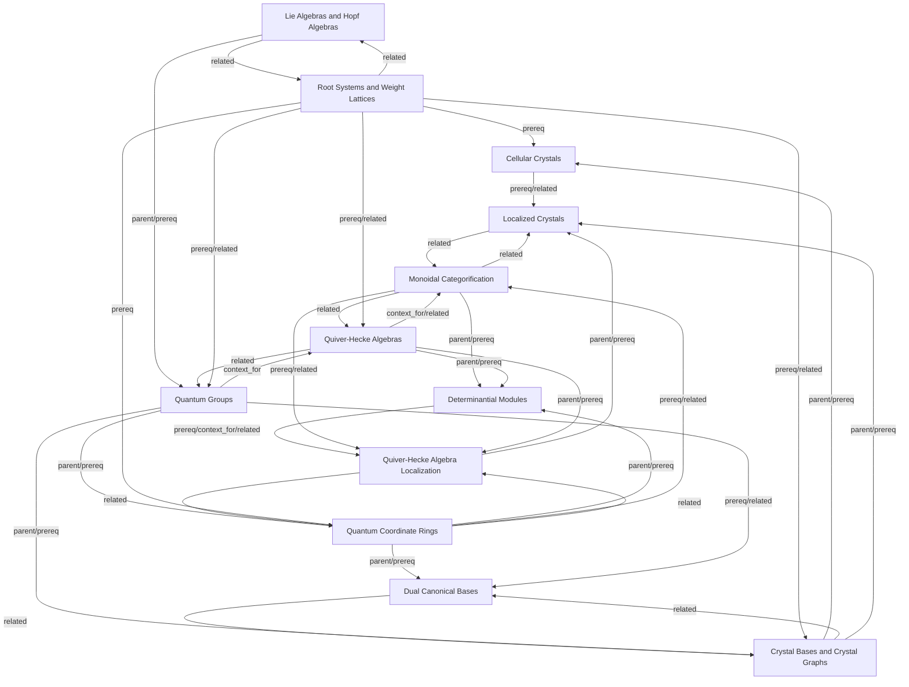

# Representation Theory Map

## Topics

- [[topics/cellular-crystals|Cellular Crystals]]
- [[topics/crystal-bases|Crystal Bases and Crystal Graphs]]
- [[topics/determinantial-modules|Determinantial Modules]]
- [[topics/dual-canonical-bases|Dual Canonical Bases]]
- [[topics/lie-algebras-and-hopf-algebras|Lie Algebras and Hopf Algebras]]
- [[topics/localized-crystals|Localized Crystals]]
- [[topics/monoidal-categorification|Monoidal Categorification]]
- [[topics/quantum-coordinate-rings|Quantum Coordinate Rings]]
- [[topics/quantum-groups|Quantum Groups]]
- [[topics/quiver-hecke-algebra-localization|Quiver-Hecke Algebra Localization]]
- [[topics/quiver-hecke-algebras|Quiver-Hecke Algebras]]
- [[topics/root-systems-and-weight-lattices|Root Systems and Weight Lattices]]
