```mermaid
flowchart TD
  abstract_crystals["Abstract Crystals"]
  affine_cuspidal_modules["Affine Cuspidal Modules"]
  affine_objects_in_monoidal_categories["Affine Objects in Monoidal Categories"]
  b_infinity_crystal["The Crystal B(infinity)"]
  category_localization["Localization of Categories"]
  category_o["Quantum Category O"]
  category_theory["Category Theory"]
  cellular_crystals["Cellular Crystals"]
  characters_of_representations["Characters of Representations"]
  cluster_algebras["Cluster Algebras"]
  coordinate_formulas_for_quantum_twist_on_localized_crystals["Coordinate Formulas for Quantum Twist on Localized Crystals"]
  crystal_bases["Crystal Bases"]
  demazure_crystals["Demazure Crystals"]
  demazure_subcategories_of_quiver_hecke_modules["Demazure Subcategories of Quiver-Hecke Modules"]
  determinantial_modules["Determinantial Modules"]
  dual_canonical_bases["Dual Canonical Bases"]
  graded_monoidal_categories["Graded Monoidal Categories"]
  grothendieck_rings_of_monoidal_categories["Grothendieck Rings of Monoidal Categories"]
  head_simplicity_of_convolutions["Head Simplicity of Convolutions"]
  hernandez_leclerc_categories["Hernandez-Leclerc Categories"]
  highest_weight_crystals["Highest Weight Crystals"]
  highest_weight_modules["Highest-Weight Modules"]
  integral_forms_of_quantum_groups["Integral Forms of Quantum Groups"]
  left_and_right_g_vectors["Left and Right g-Vectors"]
  lie_algebra_representations["Lie Algebra Representations"]
  localized_crystals["Localized Crystals"]
  localized_pbw_parametrizations["Localized PBW Parametrizations"]
  localized_root_operators["Localized Root Operators"]
  localized_string_parametrizations["Localized String Parametrizations"]
  monoidal_categorification["Monoidal Categorification"]
  normal_sequences["Normal Sequences"]
  pbw_parametrizations_of_quantum_unipotent_coordinate_rings["PBW Parametrizations of Quantum Unipotent Coordinate Rings"]
  pbw_theory_for_quantum_affine_algebras["PBW Theory for Quantum Affine Algebras"]
  pro_categories["Pro-Categories"]
  q_characters_and_l_weights["q-Characters and l-Weights"]
  quantum_affine_algebras["Quantum Affine Algebras"]
  quantum_affine_r_matrix_denominators["Quantum Affine R-Matrix Denominators"]
  quantum_affine_schur_weyl_duality["Quantum Affine Schur-Weyl Duality"]
  quantum_cluster_algebras["Quantum Cluster Algebras"]
  quantum_coordinate_rings["Quantum Coordinate Rings"]
  quantum_groups["Quantum Groups"]
  quantum_minors_and_frozen_variables["Quantum Minors and Frozen Variables"]
  quantum_twist_automorphisms["Quantum Twist Automorphisms"]
  quantum_unipotent_coordinate_rings["Quantum Unipotent Coordinate Rings"]
  quasi_rigid_monoidal_categories["Quasi-Rigid Monoidal Categories"]
  quiver_hecke_algebras["Quiver-Hecke Algebras"]
  quiver_hecke_category_localization["Quiver-Hecke Category Localization"]
  quiver_hecke_module_categories["Quiver-Hecke Module Categories"]
  quiver_hecke_subcategories["Quiver-Hecke Subcategories"]
  r_matrix_renormalization["R-Matrix Renormalization"]
  reverse_equivalence_of_localized_categories["Reverse Equivalence of Localized Categories"]
  root_objects_in_localized_categories["Root Objects in Localized Categories"]
  root_of_unity_quantum_groups["Root-of-Unity Quantum Groups"]
  root_systems_and_weight_lattices["Root Systems and Weight Lattices"]
  shuffle_lemmas_for_quiver_hecke_modules["Shuffle Lemmas for Quiver-Hecke Modules"]
  string_parametrizations_of_demazure_crystals["String Parametrizations of Demazure Crystals"]
  tensor_products_of_crystals["Tensor Products of Crystals"]
  type_a_klr_segment_modules["Type A KLR Segment Modules"]
  type_a_segment_module_convolutions["Type A Segment Module Convolutions"]
  universal_enveloping_algebras["Universal Enveloping Algebras"]
  universal_r_matrix["Universal R-Matrix"]
  verma_modules["Verma Modules"]
  weight_modules["Weight Modules"]
  yang_baxter_equation["Yang-Baxter Equation"]
  affine_cuspidal_modules -->|parent| pbw_theory_for_quantum_affine_algebras
  b_infinity_crystal -->|parent| demazure_crystals
  category_localization -->|parent| quiver_hecke_category_localization
  category_o -->|parent| verma_modules
  category_theory -->|parent| category_localization
  category_theory -->|parent| graded_monoidal_categories
  category_theory -->|parent| pro_categories
  cluster_algebras -->|parent| quantum_cluster_algebras
  crystal_bases -->|parent| abstract_crystals
  crystal_bases -->|parent| b_infinity_crystal
  crystal_bases -->|parent| cellular_crystals
  crystal_bases -->|parent| demazure_crystals
  crystal_bases -->|parent| highest_weight_crystals
  crystal_bases -->|parent| string_parametrizations_of_demazure_crystals
  crystal_bases -->|parent| tensor_products_of_crystals
  demazure_crystals -->|parent| string_parametrizations_of_demazure_crystals
  graded_monoidal_categories -->|parent| affine_objects_in_monoidal_categories
  graded_monoidal_categories -->|parent| quasi_rigid_monoidal_categories
  graded_monoidal_categories -->|parent| r_matrix_renormalization
  highest_weight_modules -->|parent| verma_modules
  lie_algebra_representations -->|parent| weight_modules
  localized_crystals -->|parent| left_and_right_g_vectors
  localized_crystals -->|parent| localized_pbw_parametrizations
  localized_crystals -->|parent| localized_root_operators
  localized_crystals -->|parent| localized_string_parametrizations
  localized_crystals -->|parent| quantum_twist_automorphisms
  monoidal_categorification -->|parent| determinantial_modules
  monoidal_categorification -->|parent| grothendieck_rings_of_monoidal_categories
  normal_sequences -->|parent| head_simplicity_of_convolutions
  pro_categories -->|parent| affine_objects_in_monoidal_categories
  quantum_affine_algebras -->|parent| affine_cuspidal_modules
  quantum_affine_algebras -->|parent| hernandez_leclerc_categories
  quantum_affine_algebras -->|parent| pbw_theory_for_quantum_affine_algebras
  quantum_affine_algebras -->|parent| q_characters_and_l_weights
  quantum_affine_algebras -->|parent| quantum_affine_r_matrix_denominators
  quantum_affine_algebras -->|parent| quantum_affine_schur_weyl_duality
  quantum_coordinate_rings -->|parent| determinantial_modules
  quantum_coordinate_rings -->|parent| dual_canonical_bases
  quantum_coordinate_rings -->|parent| quantum_unipotent_coordinate_rings
  quantum_groups -->|parent| category_o
  quantum_groups -->|parent| crystal_bases
  quantum_groups -->|parent| integral_forms_of_quantum_groups
  quantum_groups -->|parent| quantum_coordinate_rings
  quantum_groups -->|parent| root_of_unity_quantum_groups
  quantum_groups -->|parent| universal_r_matrix
  quantum_twist_automorphisms -->|parent| coordinate_formulas_for_quantum_twist_on_localized_crystals
  quantum_unipotent_coordinate_rings -->|parent| pbw_parametrizations_of_quantum_unipotent_coordinate_rings
  quantum_unipotent_coordinate_rings -->|parent| quantum_minors_and_frozen_variables
  quasi_rigid_monoidal_categories -->|parent| root_objects_in_localized_categories
  quiver_hecke_algebras -->|parent| quiver_hecke_module_categories
  quiver_hecke_category_localization -->|parent| localized_crystals
  quiver_hecke_category_localization -->|parent| reverse_equivalence_of_localized_categories
  quiver_hecke_category_localization -->|parent| root_objects_in_localized_categories
  quiver_hecke_module_categories -->|parent| head_simplicity_of_convolutions
  quiver_hecke_module_categories -->|parent| quiver_hecke_subcategories
  quiver_hecke_module_categories -->|parent| r_matrix_renormalization
  quiver_hecke_module_categories -->|parent| shuffle_lemmas_for_quiver_hecke_modules
  quiver_hecke_module_categories -->|parent| type_a_klr_segment_modules
  quiver_hecke_subcategories -->|parent| demazure_subcategories_of_quiver_hecke_modules
  quiver_hecke_subcategories -->|parent| determinantial_modules
  quiver_hecke_subcategories -->|parent| quiver_hecke_category_localization
  r_matrix_renormalization -->|parent| normal_sequences
  root_objects_in_localized_categories -->|parent| localized_root_operators
  type_a_klr_segment_modules -->|parent| type_a_segment_module_convolutions
  weight_modules -->|parent| category_o
  weight_modules -->|parent| characters_of_representations
  weight_modules -->|parent| highest_weight_modules
```

## Topics

- [[topics/02-crystal-bases/abstract-crystals|Abstract Crystals]]
- [[topics/07-quantum-affine-algebras/affine-cuspidal-modules|Affine Cuspidal Modules]]
- [[topics/03-category-theory/affine-objects-in-monoidal-categories|Affine Objects in Monoidal Categories]]
- [[topics/02-crystal-bases/b-infinity-crystal|The Crystal B(infinity)]]
- [[topics/08-localization-of-categories/category-localization|Localization of Categories]]
- [[topics/01-quantum-groups/category-o|Quantum Category O]]
- [[topics/03-category-theory/category-theory|Category Theory]]
- [[topics/02-crystal-bases/cellular-crystals|Cellular Crystals]]
- [[topics/01-quantum-groups/characters-of-representations|Characters of Representations]]
- [[topics/04-cluster-algebras/cluster-algebras|Cluster Algebras]]
- [[topics/08-localization-of-categories/coordinate-formulas-for-quantum-twist-on-localized-crystals|Coordinate Formulas for Quantum Twist on Localized Crystals]]
- [[topics/02-crystal-bases/crystal-bases|Crystal Bases]]
- [[topics/02-crystal-bases/demazure-crystals|Demazure Crystals]]
- [[topics/06-quiver-hecke-klr-algebras/demazure-subcategories-of-quiver-hecke-modules|Demazure Subcategories of Quiver-Hecke Modules]]
- [[topics/06-quiver-hecke-klr-algebras/determinantial-modules|Determinantial Modules]]
- [[topics/01-quantum-groups/dual-canonical-bases|Dual Canonical Bases]]
- [[topics/03-category-theory/graded-monoidal-categories|Graded Monoidal Categories]]
- [[topics/05-monoidal-categorification/grothendieck-rings-of-monoidal-categories|Grothendieck Rings of Monoidal Categories]]
- [[topics/06-quiver-hecke-klr-algebras/head-simplicity-of-convolutions|Head Simplicity of Convolutions]]
- [[topics/07-quantum-affine-algebras/hernandez-leclerc-categories|Hernandez-Leclerc Categories]]
- [[topics/02-crystal-bases/highest-weight-crystals|Highest Weight Crystals]]
- [[topics/01-quantum-groups/highest-weight-modules|Highest-Weight Modules]]
- [[topics/01-quantum-groups/integral-forms-of-quantum-groups|Integral Forms of Quantum Groups]]
- [[topics/08-localization-of-categories/left-and-right-g-vectors|Left and Right g-Vectors]]
- [[topics/01-quantum-groups/lie-algebra-representations|Lie Algebra Representations]]
- [[topics/08-localization-of-categories/localized-crystals|Localized Crystals]]
- [[topics/08-localization-of-categories/localized-pbw-parametrizations|Localized PBW Parametrizations]]
- [[topics/08-localization-of-categories/localized-root-operators|Localized Root Operators]]
- [[topics/08-localization-of-categories/localized-string-parametrizations|Localized String Parametrizations]]
- [[topics/05-monoidal-categorification/monoidal-categorification|Monoidal Categorification]]
- [[topics/06-quiver-hecke-klr-algebras/normal-sequences|Normal Sequences]]
- [[topics/01-quantum-groups/pbw-parametrizations-of-quantum-unipotent-coordinate-rings|PBW Parametrizations of Quantum Unipotent Coordinate Rings]]
- [[topics/07-quantum-affine-algebras/pbw-theory-for-quantum-affine-algebras|PBW Theory for Quantum Affine Algebras]]
- [[topics/03-category-theory/pro-categories|Pro-Categories]]
- [[topics/07-quantum-affine-algebras/q-characters-and-l-weights|q-Characters and l-Weights]]
- [[topics/07-quantum-affine-algebras/quantum-affine-algebras|Quantum Affine Algebras]]
- [[topics/07-quantum-affine-algebras/quantum-affine-r-matrix-denominators|Quantum Affine R-Matrix Denominators]]
- [[topics/07-quantum-affine-algebras/quantum-affine-schur-weyl-duality|Quantum Affine Schur-Weyl Duality]]
- [[topics/04-cluster-algebras/quantum-cluster-algebras|Quantum Cluster Algebras]]
- [[topics/01-quantum-groups/quantum-coordinate-rings|Quantum Coordinate Rings]]
- [[topics/01-quantum-groups/quantum-groups|Quantum Groups]]
- [[topics/01-quantum-groups/quantum-minors-and-frozen-variables|Quantum Minors and Frozen Variables]]
- [[topics/08-localization-of-categories/quantum-twist-automorphisms|Quantum Twist Automorphisms]]
- [[topics/01-quantum-groups/quantum-unipotent-coordinate-rings|Quantum Unipotent Coordinate Rings]]
- [[topics/03-category-theory/quasi-rigid-monoidal-categories|Quasi-Rigid Monoidal Categories]]
- [[topics/06-quiver-hecke-klr-algebras/quiver-hecke-algebras|Quiver-Hecke Algebras]]
- [[topics/08-localization-of-categories/quiver-hecke-category-localization|Quiver-Hecke Category Localization]]
- [[topics/06-quiver-hecke-klr-algebras/quiver-hecke-module-categories|Quiver-Hecke Module Categories]]
- [[topics/06-quiver-hecke-klr-algebras/quiver-hecke-subcategories|Quiver-Hecke Subcategories]]
- [[topics/06-quiver-hecke-klr-algebras/r-matrix-renormalization|R-Matrix Renormalization]]
- [[topics/08-localization-of-categories/reverse-equivalence-of-localized-categories|Reverse Equivalence of Localized Categories]]
- [[topics/08-localization-of-categories/root-objects-in-localized-categories|Root Objects in Localized Categories]]
- [[topics/01-quantum-groups/root-of-unity-quantum-groups|Root-of-Unity Quantum Groups]]
- [[topics/01-quantum-groups/root-systems-and-weight-lattices|Root Systems and Weight Lattices]]
- [[topics/06-quiver-hecke-klr-algebras/shuffle-lemmas-for-quiver-hecke-modules|Shuffle Lemmas for Quiver-Hecke Modules]]
- [[topics/02-crystal-bases/string-parametrizations-of-demazure-crystals|String Parametrizations of Demazure Crystals]]
- [[topics/02-crystal-bases/tensor-products-of-crystals|Tensor Products of Crystals]]
- [[topics/06-quiver-hecke-klr-algebras/type-a-klr-segment-modules|Type A KLR Segment Modules]]
- [[topics/06-quiver-hecke-klr-algebras/type-a-segment-module-convolutions|Type A Segment Module Convolutions]]
- [[topics/01-quantum-groups/universal-enveloping-algebras|Universal Enveloping Algebras]]
- [[topics/01-quantum-groups/universal-r-matrix|Universal R-Matrix]]
- [[topics/01-quantum-groups/verma-modules|Verma Modules]]
- [[topics/01-quantum-groups/weight-modules|Weight Modules]]
- [[topics/01-quantum-groups/yang-baxter-equation|Yang-Baxter Equation]]
